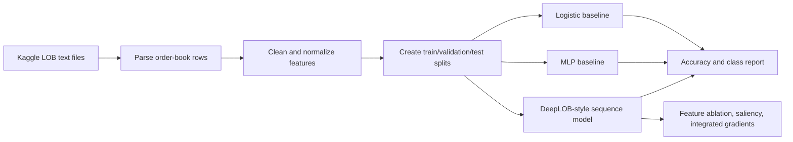

# Mid-Price Forecasting

Limit order books are noisy, high-frequency market microstructure data. This notebook studies whether short-horizon mid-price movement can be predicted from order-book features, then compares simple baselines with deeper sequence models and interpretability probes.

## Why This Matters

Mid-price forecasting is a useful applied ML problem because it forces the model to deal with class imbalance, temporal dependence, and weak signal-to-noise ratios. The project is also a good testbed for interpretability methods: a model that predicts price movement should expose which levels, sides, or engineered features drive its decisions.

## Method Overview

## Current Results

The checked-in notebook reports these representative metrics on the current split:

| Model | Validation accuracy | Test accuracy | Notes |
|---|---:|---:|---|
| Logistic regression baseline | 0.6087 | 0.7091 | Strong baseline for simple normalized features |
| MLP baseline | 0.5494 | 0.5943 | Did not outperform the simpler baseline on this split |
| DeepLOB-style sequence model | 0.8040 validation during training | Notebook includes sequence evaluation workflow | Best direction for further work |

These numbers should be treated as exploratory notebook results, not production trading claims.

## Dataset

This project uses the benchmark dataset by Ntakaris et al., available through Kaggle:

- Dataset: <https://www.kaggle.com/datasets/praanj/limit-orderbook-data?resource=download>
- Paper: Ntakaris, Adamantios, et al. "Benchmark dataset for mid-price forecasting of limit order book data with machine learning methods." *Journal of Forecasting* 37.8 (2018): 852-866.

After downloading, create a `Data/` folder in the repository root and place the dataset text files there.

## Reproduce

1. Install a Python environment with Jupyter, pandas, scikit-learn, PyTorch, matplotlib, and Captum.
2. Download the Kaggle dataset into `Data/`.
3. Open `baseline.ipynb`.
4. Run the notebook from top to bottom.

The notebook contains the full data preparation, model training, evaluation, and interpretability workflow.

## Limitations

- The dataset is external and not committed.
- The results depend on the current split and notebook state.
- The project is research exploration, not a deployed financial system.
- Further work should add a scriptable training entry point, fixed environment file, and saved result artifacts.

Interested in this area? Email me at praneeth.suresh.s@gmail.com.
